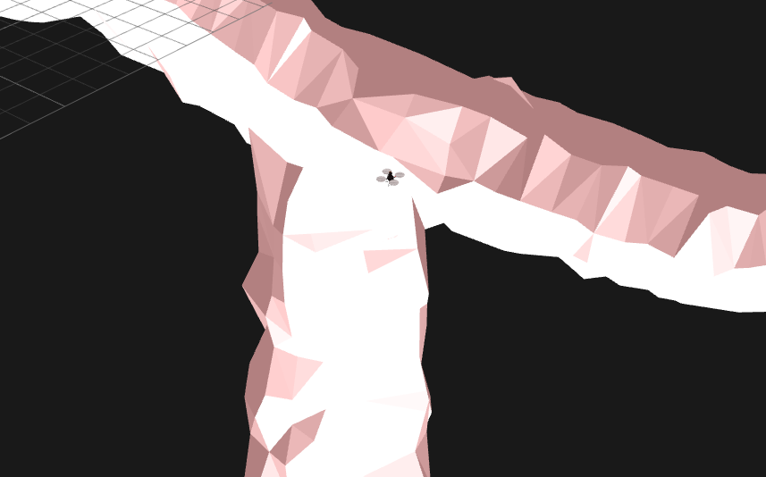

# What is this?

Code running on ROS to simulate UAV navigation in a tunnel modeled by Blender.
The program provides a reactive control for a UAV which takes an action as it receives sensory data from the environment so it can follow the wall of the tunnel while avoiding collision.



## Required Environment
- OS: Ubuntu 16.04
- ROS version: Kinetic

## Setup
This package requires hector-quadrotor. Check [the details](SETUP.md).

## Installation of this package
```
cd ~/catkin/src
git clone git@github.com:tidota/quadrotor-tunnel-nav.git
cd ..
catkin_make
```

## How to run
You need to launch two parts in separated terminal windows: gazebo and controller.

gazebo:
```
roslaunch quadrotor_tunnel_nav uav_Y-tunnel.launch
```
controller:<br>
The hector-quadrotor (built from the source) apparently [disables the motors in default](https://answers.ros.org/question/256590/hector-quadcopter-not-responding-to-cmd_vel-messages/) and it is required to enable them.
```
rosservice call /enable_motors true
roslaunch quadrotor_tunnel_nav control.launch
```
Then, you can see a quadrotor flying inside a tunnel in the simulator window.

## Reactive Agent
The program is composed of several nodes each of which represent a node to take care of a specific behavior.
Every node takes the same sensory data and makes its own decision or control outputs (geometry_msgs/Twist).
They are connected with each other by ROS topics, consisting a tree.
All messages generated by them go toward to the root node: main_control, which finally generates /cmd_vel.

A node has two options to generate its output: combine and pass the control values given by the other nodes toward the root, or block them and pass its own.
When specific conditions to its corresponding behavior are satisfied, it blocks the messages from the other nodes and passes its own toward the root.
Otherwise, it combines and passes the control values generated by the others.
This mechanism lets a specific behavior appear only in its assumed situation. For example, the node, altitude_adjustment, connects to the one, obstacle_avoidance. The obstacle_avoidance node passes the message from others only if there is no impending obstacles to avoid immediately; the altitude_adjustment node can generate its behavior without impending obstacles.

At the moment (as of Dec 25, 2017), it contains six nodes.


## Memorandum
[Misc notes of ROS commands](MEMORANDUM.md)


